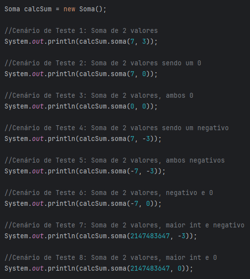

# AC1 TESTES DE SOFTWARE testes manuais
## Descrição
O projeto foi desenvolvido na IDE IntelliJ, consiste em um código simples para colocar em prova o conhecimento em testes de software, onde são realizados testes manuais.

## Funcionalidades
A partir de funcionalidades simples de cálculo básico, são realizados testes manuais a partir da classe Main com o objetivo de identificar e descrever possíveis falhas no sistema.

## Comentários
Itens utilizados para descrever falhas e observações.

## Publicação
https://github.com/Rafael-MJ/AC1-TestesDeSoftware/tree/master

## Última atualização 19/09/23
