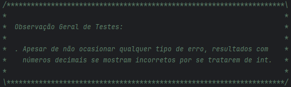

# AC1 TESTES DE SOFTWARE testes automatizados (calculadora)
## Descrição
O projeto foi desenvolvido na IDE IntelliJ, consiste em um código simples para colocar em prova o conhecimento em testes de software, onde são realizados testes manuais.

## Funcionalidades
A partir de um simples sistema que realiza cálculos básicos são realizados diversos testes a partir da classe Main com o objetivo de identificar e descrever possíveis falhas no sistema.

## Comentários
Itens utilizados para descrever falhas.

## Publicação
https://

## Última atualização 16/09/23
