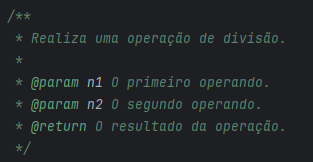
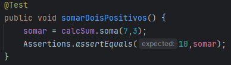
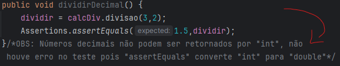

# AC1 TESTES DE SOFTWARE testes automatizados jUnitTest + Documentação

## Descrição
O projeto foi desenvolvido na IDE IntelliJ, consiste em um código simples para colocar em prova o conhecimento em testes de software, onde são realizados testes manuais e a devida documentação.

## Documentação
Classes, métodos, variáveis e parâmetros possuem a documentação necessária.

## JavaDoc
doc/funcionalidades/package-summary.html

## Cenário de Teste
A partir de um simples sistema que realiza cálculos básicos são realizados diversos testes utilizando jUnit a partir da classe CalculadoraJUnitTest, identificando e descrevendo possíveis falhas.

## Comentários
Recursos utilizados para apontar falhas e observações.

## Publicação
https://github.com/Rafael-MJ/TQS-Calculadora/tree/CalculadoraJUnitTest

## Última atualização 07/11/23
